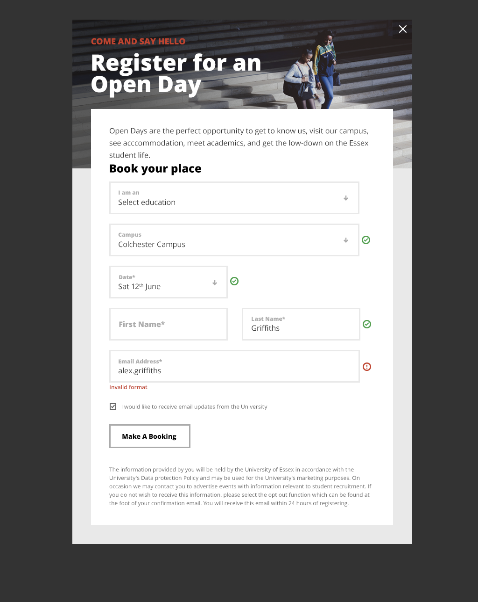

# vue-example-modalform

> A Vue.js project with example modal form

[Live Demonstration](https://valyakin.github.io/vue-example-modalform)

## Task
* Page must be compatible with two laste versions of every popular browser(Chrome, FireFox, Edge, IE, Safari)
* Adaptive layout for mobile screens (less than 769px)
* Submit form must be a modal window
* Form must be scrollable

Using CSS preprocessors(LESS/SASS/PostCSS), webpack for project building and ES6 will be a major advantage.

## Mockups

### Desktop



### Mobile


## Build Setup

``` bash
# install dependencies
yarn

# serve with hot reload at localhost:8080
yarn dev

# build for production with minification
yarn build
```
